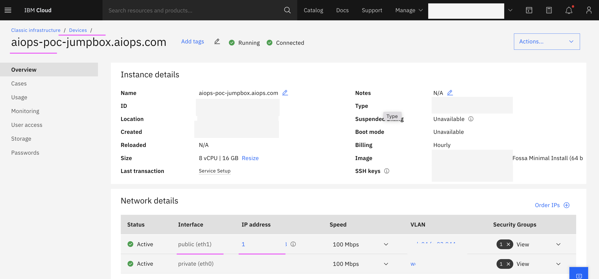
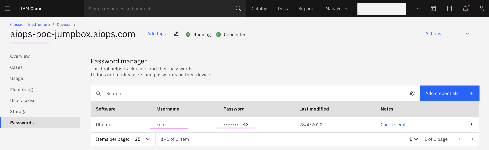
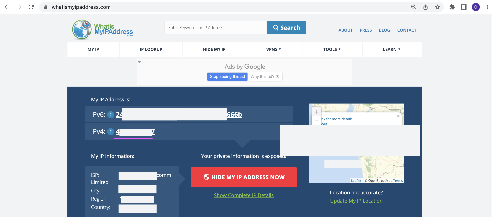
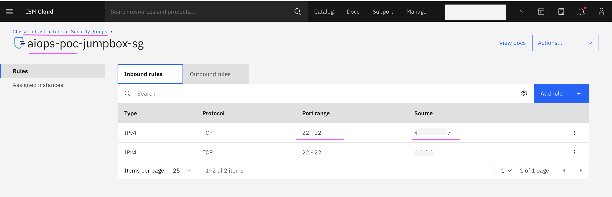

# Granting Virtual Server Access

This document explains about how give access to the Virtual Server for any user to connect.

If you have admin access to the IBM Cloud account, you can do all the below steps, otherwise check with admin.

## 1. Get IP Address of the Virtual Server

The IPAddress of the Virtual Server is high lighted here. 

## 2. Get User and Password of the Virtual Server

The User and Password of the Virtual Server is high lighted here. 

## 3. Enable access to Virtual Server from your Laptop

You need to add your Laptop IP as a remote IP to access the Virtual Server. 

1. Goto https://whatismyipaddress.com/ to know the IPAddress of your laptop

2. Create an entry here in this page with your IPAddress.

