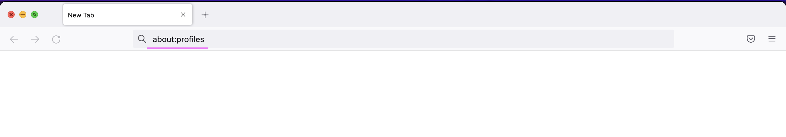
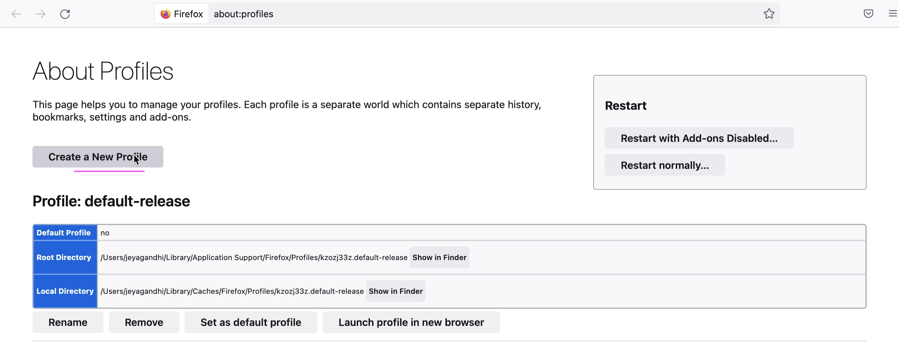
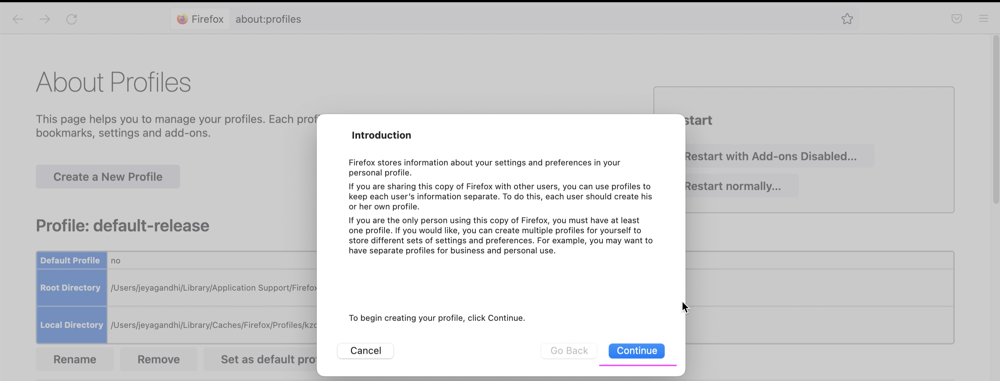
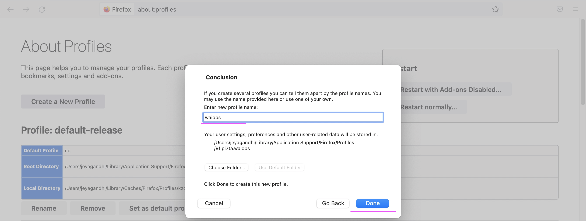
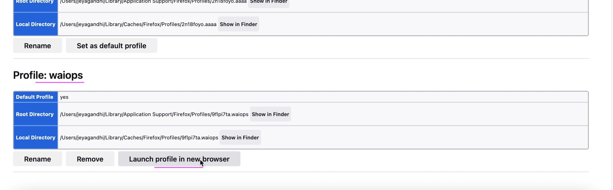
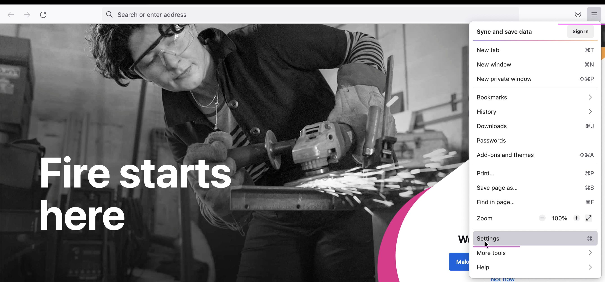
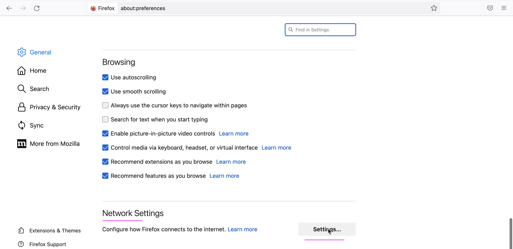
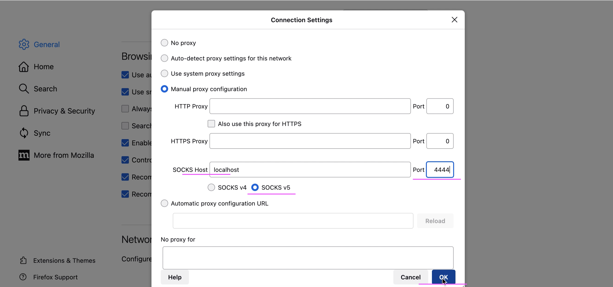

# Creating new profile in Firefox

This document explains about how to create new profile in Firefox to access VPC via Virtual Server.

## Steps

This is a one time process. Once it is done you don't need to repeat everytime you access.

1. In a Firefox browser, new tab, enter `about:profiles` in the address bar

The About Profile page opens.

2. Click `Create a New Profile`

3. Click `Continue`

4. Enter `New Profile Name`. ex: `waiops`

5. Click `Done`

Profile might have been created and available in the bottom of the page.

6. Click `Launch profile in new browser`

It opens new browser window. 

7. Click on `Settings`

8. In the opened page, goto the `Network Settings`

9. Click on `Settings`

10. Enter the following 

- SOCKS Host : localhost
- Port : 4444
- Choose Option : SOCKS v5

11. Click on `OK`

## References

This document is based on https://pages.github.ibm.com/hdm-swat/guides/vpn-secured-cluster/
