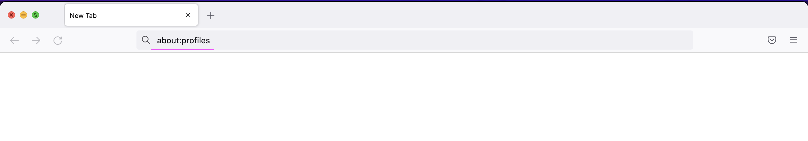
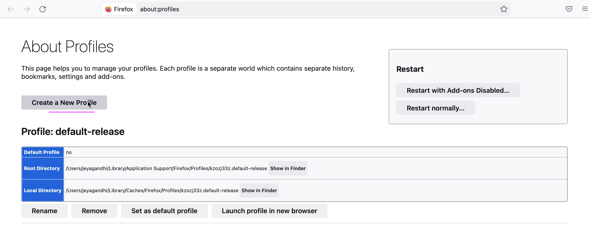
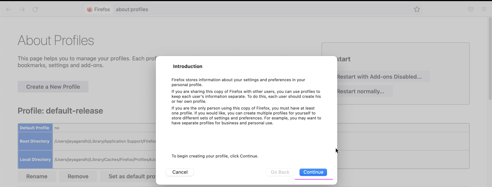
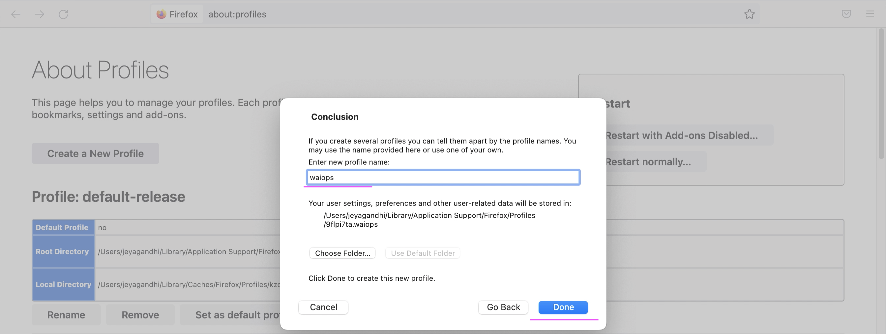
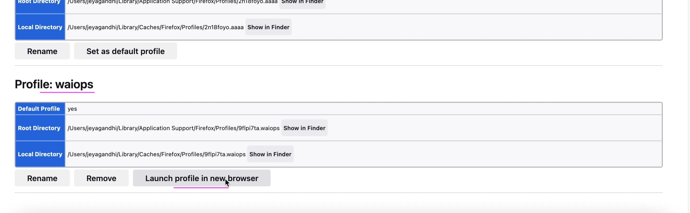
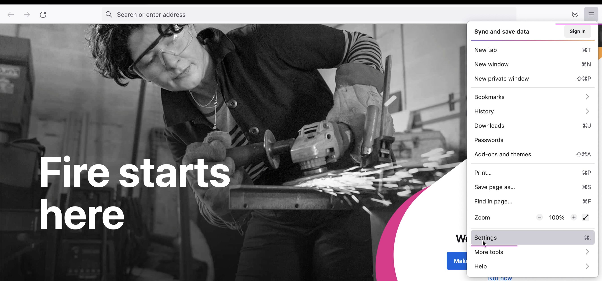
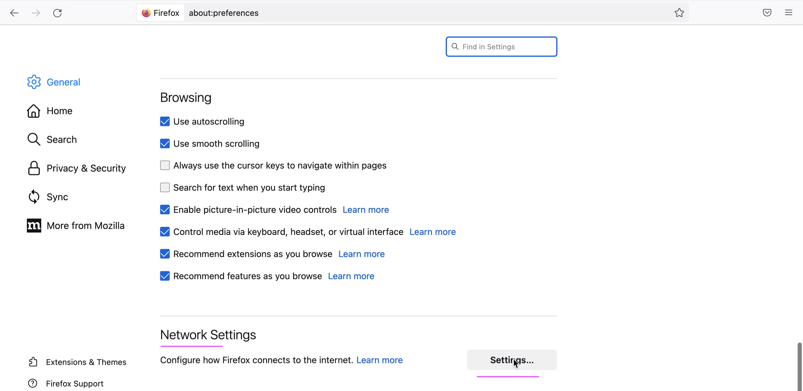
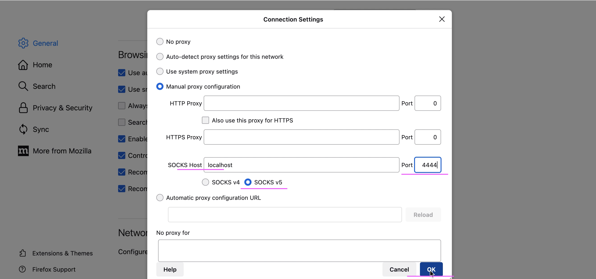
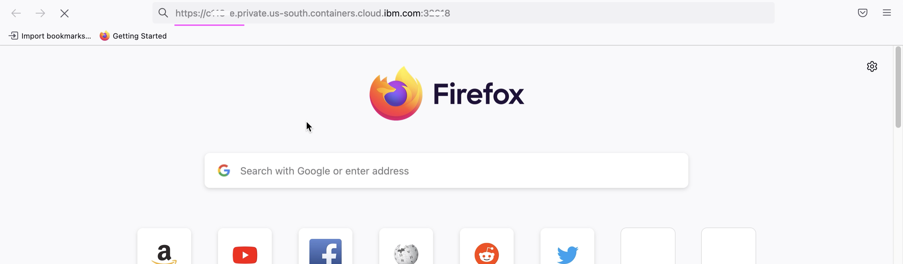
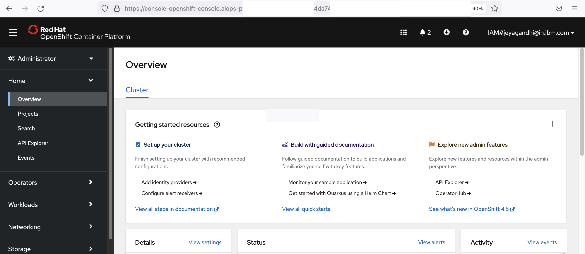

# Accessing OpenShift via Console

This document explains about how to access OpenShift installed in VPC via Console 

This document is based on https://pages.github.ibm.com/hdm-swat/guides/vpn-secured-cluster/

## PreRequisite

The following are required as a prereq for proceeding with this document.

-  Proxy Virtual Server IP Address (where  strongSwan is installed)

    Ex: `1.2.3.4`

-  Private URL of the Openshift console

    Ex: `https://c111-e.private.us-south.containers.cloud.ibm.com:11111`


## Steps

Here are the steps we are going to do

1. Create new Firefox profile (one time process)
2. Create ssh proxy to the strongSwan in Virtual Server
3. Access OpenShift Console

## 1. Create new Firefox profile

This is a one time process. 

1. In a Firefox browser, new tab, enter `about:profiles` in the address bar



The About Profile page opens.

2. Click `Create a New Profile`



3. Click `Continue`



4. Enter `New Profile Name`. ex: `waiops`

5. Click `Done`



Profile might have been created and available in the bottom of the page.

6. Click `Launch profile in new browser`



It opens new browser window. 

7. Click on `Settings`



8. In the opened page, goto the `Network Settings`

9. Click on `Settings`



10. Enter the following 

- SOCKS Host : localhost
- Port : 4444
- Choose Option : SOCKS v5

11. Click on `OK`




## 2. Create ssh proxy to the strongSwan in Virtual Server

Replace < virtual-server-ip > in the below command and run the same in a command shell.

```
ssh -N -D 4444 root@<virtual-server-ip>
```

Leave this session open

## 3. Access OpenShift Console

1. Enter `about:profiles` in the address bar of the Firefox browser.


About Profile page opens.

Already created profile is available in the bottom of the page.

2. Click `Launch profile in new browser`


3. Enter the `Private URL of the Openshift`



4. After the login and all you can see the Openshift console page.



