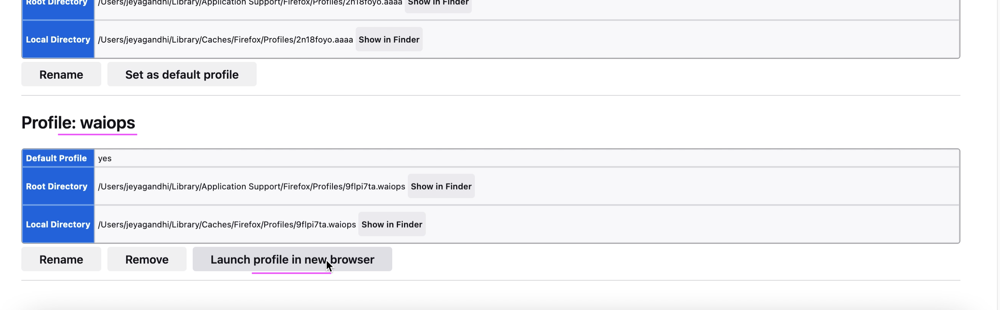

# Accessing Watson AIOps AI-Manager Console

This document explains about how to access Watson AIOps AI-Manager Console.

## 1. Create new profile in Firefox profile

This is one time process. You can skip if it is already done.

Refer [../22-create-new-profile-in-firefox](../22-create-new-profile-in-firefox)

## 2. Create ssh proxy to the strongSwan in Virtual Server

Refer [../23-create-ssh-proxy-to-virtual-server](../23-create-ssh-proxy-to-virtual-server)

## 3. Access AI-Manager Console

1. Enter `about:profiles` in the address bar of the Firefox browser.


About Profile page opens.

Already created profile is available in the bottom of the page.

2. Click `Launch profile in new browser`



3. Enter the AI-Mgr url in the browser. 

The URL, User, Password details you should have received like this.

```
=====================================================================================================
URL : https://cpd-cp4waiops.aaaaaaaa.ams03.containers.appdomain.cloud
USER: admin
PASSWORD: EpU2m........................jYUz
=====================================================================================================

```

## References

This document is based on https://pages.github.ibm.com/hdm-swat/guides/vpn-secured-cluster/
